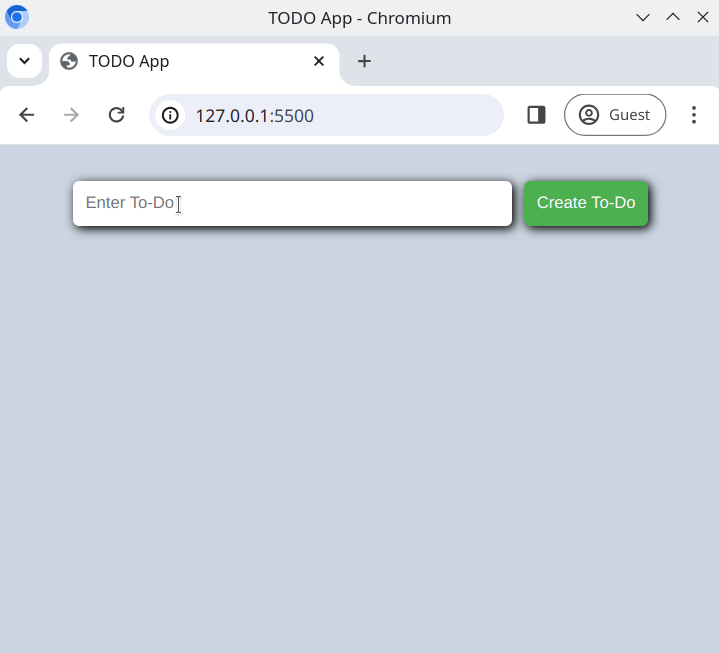

# ToDo List

Building a "todo" list app is something _all_ developers have done when learning to code. Now is your turn!

## Task

The todo application is a simple list with an editor. A user can add and remove items from the list.

Writing your solution in [index.html](./index.html), [js/main.js](./js/main.js) and [css/style.css](/css/style.css), create a functioning todo application.

## Requirements

- There should be an `<input />` field for the user to add a todo entry
- There should be a `<button>` which will add the todo entry to the list
- When a user has added a todo to the list, the todo entry should be displayed on the page
- Each todo entry should have the UI elements;
  - a **delete** `<button>`, which removes the todo item from the list

## Expected Result

## Bonus Task

Add a **done** `<button>` (it could have an icon of a checkmark) for each todo entry, which will toggle a strikethrough effect on the todo item text.

[//]: # (autograding info start)
#  Results
> ⌛ Give it a minute. As long as you see the orange dot  on top, CodeBuddy is still processing. Refresh this page to see it's current status.
>
> This is what CodeBuddy found when running your code. It is to show you what you have achieved and to give you hints on how to complete the exercise.

### Add ToDos

|                 Status                  | Check                                                                                    |
| :-------------------------------------: | :--------------------------------------------------------------------------------------- |
|  | Page should contain task input field |
|  | Page should contain 'Create Task' button |
|  | Task is created when entering text into input field and clicking button |

### Delete ToDos

|                 Status                  | Check                                                                                    |
| :-------------------------------------: | :--------------------------------------------------------------------------------------- |
|  | Items should have 'x' delete button |
|  | Items is removed when clicking 'x' button |

[🔬 Results Details](../../actions)
[🐞 Tips on Debugging](https://github.com/DCI-EdTech/autograding-setup/wiki/How-to-work-with-CodeBuddy)
[📢 Report Problem](https://docs.google.com/forms/d/e/1FAIpQLSfS8wPh6bCMTLF2wmjiE5_UhPiOEnubEwwPLN_M8zTCjx5qbg/viewform?usp=pp_url&entry.652569746=spa-dom-todo-list)

[//]: # (autograding info end)